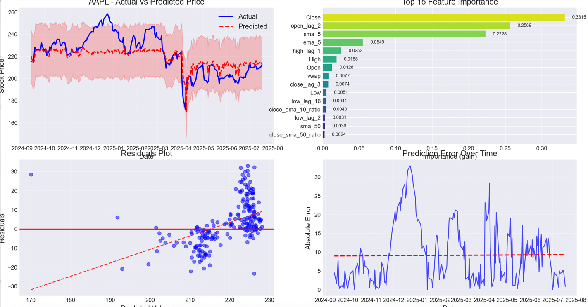
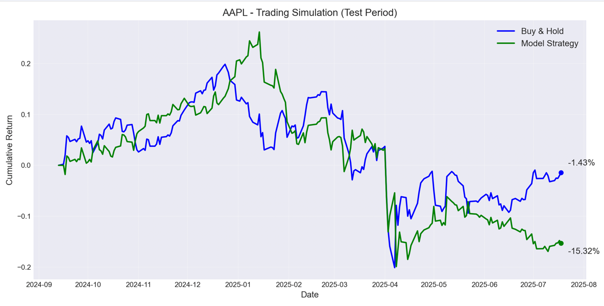

# Stock Price Prediction Using Machine Learning

This repository contains code for predicting stock prices using various machine learning models including XGBoost, Transformer, and LSTM. The project includes data fetching, feature engineering, model training, and prediction pipelines.

## Models

### XGBoost Model
XGBoost is a gradient boosting framework that uses decision trees. It's known for its speed and performance. This implementation uses advanced feature engineering including technical indicators and provides caching functionality for efficient data handling.

### Transformer Model
Transformer models use the attention mechanism to capture temporal dependencies in time series data. This implementation leverages self-attention to focus on relevant parts of the historical price data.

### LSTM Model
Long Short-Term Memory (LSTM) networks are a type of recurrent neural network capable of learning order dependence in sequence prediction problems. The LSTM implementation in this project is especially suitable for time series forecasting like stock prices.

## Features

- **Data Fetching**: Automated data retrieval from Yahoo Finance
- **Data Caching**: Efficient data storage with proper timezone handling
- **Feature Engineering**: Comprehensive technical indicators and derived features
- **Model Training**: Optimized training pipelines for each model type
- **Model Persistence**: Save and load trained models
- **Prediction**: Make future predictions with trained models
- **Visualization**: Comparative performance analysis and prediction visualization
- **Evaluation**: Comprehensive metrics for model assessment

## Installation

```bash
# Clone the repository
git clone https://github.com/yourusername/stock-price-prediction.git
cd stock-price-prediction

# Create a virtual environment
python -m venv venv
source venv/bin/activate  # On Windows: venv\Scripts\activate

# Install dependencies
pip install -r requirement.txt
```

## Usage

### Training Models

```python
# XGBoost Model
from algorithms.XGBoost import StockPricePredictor

# Initialize predictor
xgb_predictor = StockPricePredictor(
    symbol="AAPL",
    period="5y",
    test_size=0.2
)

# Train model
xgb_predictor.train_model()

# Transformer Model
from algorithms.Transformer import StockPriceTransformer

# Initialize and train
transformer = StockPriceTransformer(symbol="AAPL", period="5y")
transformer.train_model()

# LSTM Model
from algorithms.LSTM import LSTMStockPredictor

# Initialize and train
lstm_predictor = LSTMStockPredictor(
    symbol="AAPL",
    period="5y",
    test_size=0.2
)
lstm_predictor.run_pipeline()
```

### Making Predictions

```python
# Load saved models and make predictions
from algorithms.XGBoost import StockPricePredictor

# Load model
predictor = StockPricePredictor(symbol="AAPL")
predictor.load_model(load_pipeline=True)

# Predict future prices
future_predictions = predictor.predict_future(days=5)
print(future_predictions)
```

### Comparing Models

You can compare all three models using the provided script:

```bash
python compare_all_models.py
```

This will generate performance metrics and visualizations comparing XGBoost, Transformer, and LSTM models.

## Documentation

This project includes comprehensive documentation built with Jekyll. The documentation covers model architecture, usage examples, API reference, and model comparisons.

### Building the Documentation

To build and view the documentation locally:

```bash
# Navigate to the docs directory
cd docs

# Install Ruby dependencies (first time only)
gem install bundler jekyll
bundler install

# Start the Jekyll server
bundle exec jekyll serve
```

Once the server is running, you can access the documentation at `http://localhost:4000`.

### Documentation Structure

- **Home**: Overview of the project
- **Usage Guide**: Step-by-step instructions
- **Examples**: Practical examples with downloadable scripts
- **Models**: Detailed explanation of each model
  - XGBoost
  - Transformer
  - LSTM
- **Model Comparison**: Performance metrics and analysis
- **API Reference**: Complete reference of classes and methods

## License

This project is licensed under the MIT License - see the LICENSE file for details.

# XGBoost Stock Price Prediction Pipeline

This repository contains a comprehensive, end-to-end pipeline for predicting stock prices using an XGBoost model. The pipeline is designed with best practices for time-series forecasting, including feature engineering, hyperparameter tuning, and robust evaluation.

## Features

- **Data Fetching**: Fetches historical OHLCV data from Yahoo Finance.
- **Feature Engineering**: Creates a rich feature set including:
  - Lag features (price and volume)
  - Returns and volatility measures
  - Rolling means and momentum indicators
  - Technical indicators (RSI, MACD, Bollinger Bands, etc.)
  - Time-based features (day of week, month, year)
- **Hyperparameter Tuning**: Uses Optuna with `TimeSeriesSplit` for robust hyperparameter optimization.
- **Time-Series Aware Splitting**: Ensures the train-test split is done chronologically, without shuffling.
- **Advanced Evaluation**:
  - Standard regression metrics (RMSE, MAE, R²)
  - Walk-forward backtesting for realistic performance assessment.
  - A simple trading simulation to gauge strategy performance.
- **Visualization**: Generates insightful plots for:
  - Actual vs. Predicted prices
  - Feature importance
  - Residuals and error analysis
  - Trading simulation returns
- **Model Persistence**: Saves the trained model, scaler, and other pipeline components for future use.

## Performance Results for AAPL

The pipeline was run for the AAPL ticker with 5 years of historical data. Below is a summary of the model's performance.

### Model Evaluation

These metrics show the model's performance on the held-out test set. The model shows a very strong fit on the training data, but performance on the test set indicates overfitting, with an R² of 0.4579.

| Metric     | Train    | Test     |
|------------|----------|----------|
| **RMSE**   | 0.4778   | 12.5141  |
| **MAE**    | 0.3850   | 9.9640   |
| **MAPE**   | 0.24%    | 4.43%    |
| **R²**     | 0.9996   | 0.4579   |

### Walk-Forward Backtesting

Backtesting provides a more realistic measure of how the model would perform over time. The negative average R² suggests the model did not generalize well across different time periods.

| Metric     | Average Value |
|------------|---------------|
| **RMSE**   | 12.9639         |
| **MAE**    | 10.4006         |
| **R²**     | -0.2027         |

### Trading Simulation

A simple trading strategy was simulated on the test set. The strategy underperformed a simple "Buy & Hold" approach, indicating the model's predictions are not yet profitable.

| Metric                | Value     |
|-----------------------|-----------|
| **Buy & Hold Return** | -1.43%    |
| **Strategy Return**   | -15.32%   |
| **Win Rate**          | 52.13%    |
| **Sharpe Ratio**      | -0.42     |

### Visualizations

The following plots summarize the model's performance on the test data.

**Main Performance Dashboard**
This plot shows the actual vs. predicted prices, feature importance, residuals, and error over time.



**Trading Simulation**
This plot compares the cumulative returns of the model's strategy against a buy-and-hold strategy.



### Future Predictions

Based on the data available up to July 18, 2025, here are the price predictions for the next 5 trading days:

| Date       | Predicted Close |
|------------|-----------------|
| 2025-07-21 | 208.21          |
| 2025-07-22 | 207.88          |
| 2025-07-23 | 207.88          |
| 2025-07-24 | 207.88          |
| 2025-07-25 | 207.88          |

## How to Run

1.  **Install dependencies:**
    ```bash
    pip install yfinance pandas numpy matplotlib seaborn optuna scikit-learn xgboost ta joblib
    ```
2.  **Run the pipeline:**
    ```bash
    python XGBoost.py
    ```
    You can customize the stock symbol, data period, and other parameters inside the `if __name__ == "__main__":` block in `XGBoost.py`.
