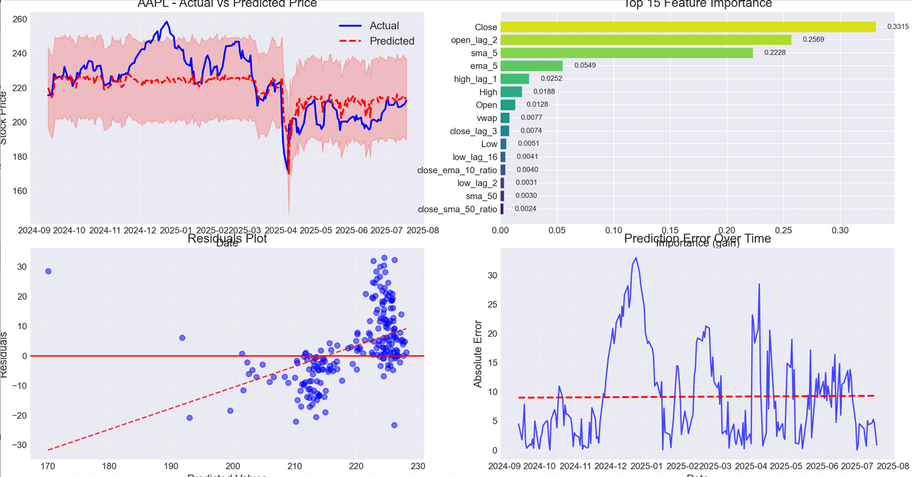

# XGBoost Stock Price Prediction Pipeline

This repository contains a comprehensive, end-to-end pipeline for predicting stock prices using an XGBoost model. The pipeline is designed with best practices for time-series forecasting, including feature engineering, hyperparameter tuning, and robust evaluation.

## Features

- **Data Fetching**: Fetches historical OHLCV data from Yahoo Finance.
- **Feature Engineering**: Creates a rich feature set including:
  - Lag features (price and volume)
  - Returns and volatility measures
  - Rolling means and momentum indicators
  - Technical indicators (RSI, MACD, Bollinger Bands, etc.)
  - Time-based features (day of week, month, year)
- **Hyperparameter Tuning**: Uses Optuna with `TimeSeriesSplit` for robust hyperparameter optimization.
- **Time-Series Aware Splitting**: Ensures the train-test split is done chronologically, without shuffling.
- **Advanced Evaluation**:
  - Standard regression metrics (RMSE, MAE, R²)
  - Walk-forward backtesting for realistic performance assessment.
  - A simple trading simulation to gauge strategy performance.
- **Visualization**: Generates insightful plots for:
  - Actual vs. Predicted prices
  - Feature importance
  - Residuals and error analysis
  - Trading simulation returns
- **Model Persistence**: Saves the trained model, scaler, and other pipeline components for future use.

## Performance Results for AAPL

The pipeline was run for the AAPL ticker with 5 years of historical data. Below is a summary of the model's performance.

### Model Evaluation

These metrics show the model's performance on the held-out test set. The model shows a very strong fit on the training data, but performance on the test set indicates overfitting, with an R² of 0.4579.

| Metric     | Train    | Test     |
|------------|----------|----------|
| **RMSE**   | 0.4778   | 12.5141  |
| **MAE**    | 0.3850   | 9.9640   |
| **MAPE**   | 0.24%    | 4.43%    |
| **R²**     | 0.9996   | 0.4579   |

### Walk-Forward Backtesting

Backtesting provides a more realistic measure of how the model would perform over time. The negative average R² suggests the model did not generalize well across different time periods.

| Metric     | Average Value |
|------------|---------------|
| **RMSE**   | 12.9639         |
| **MAE**    | 10.4006         |
| **R²**     | -0.2027         |

### Trading Simulation

A simple trading strategy was simulated on the test set. The strategy underperformed a simple "Buy & Hold" approach, indicating the model's predictions are not yet profitable.

| Metric                | Value     |
|-----------------------|-----------|
| **Buy & Hold Return** | -1.43%    |
| **Strategy Return**   | -15.32%   |
| **Win Rate**          | 52.13%    |
| **Sharpe Ratio**      | -0.42     |

### Visualizations

The following plots summarize the model's performance on the test data.

**Main Performance Dashboard**
This plot shows the actual vs. predicted prices, feature importance, residuals, and error over time.



**Trading Simulation**
This plot compares the cumulative returns of the model's strategy against a buy-and-hold strategy.


### Future Predictions

Based on the data available up to July 18, 2025, here are the price predictions for the next 5 trading days:

| Date       | Predicted Close |
|------------|-----------------|
| 2025-07-21 | 208.21          |
| 2025-07-22 | 207.88          |
| 2025-07-23 | 207.88          |
| 2025-07-24 | 207.88          |
| 2025-07-25 | 207.88          |

## How to Run

1.  **Install dependencies:**
    ```bash
    pip install yfinance pandas numpy matplotlib seaborn optuna scikit-learn xgboost ta joblib
    ```
2.  **Run the pipeline:**
    ```bash
    python XGBoost.py
    ```
    You can customize the stock symbol, data period, and other parameters inside the `if __name__ == "__main__":` block in `XGBoost.py`.

